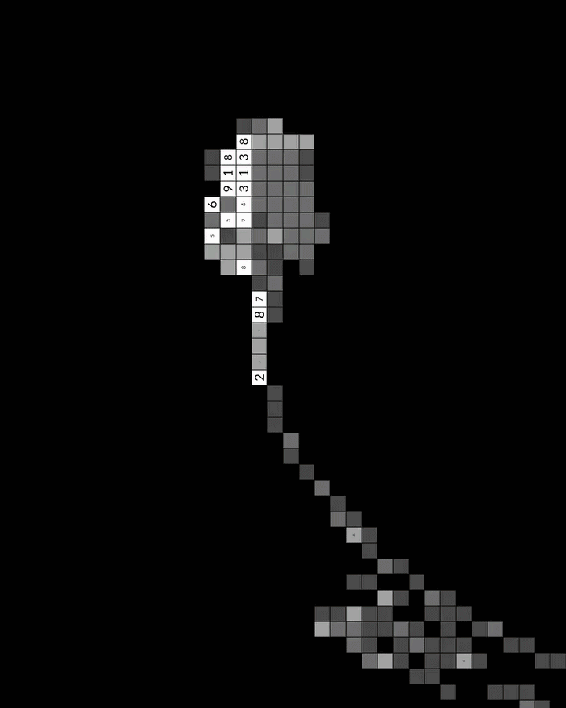
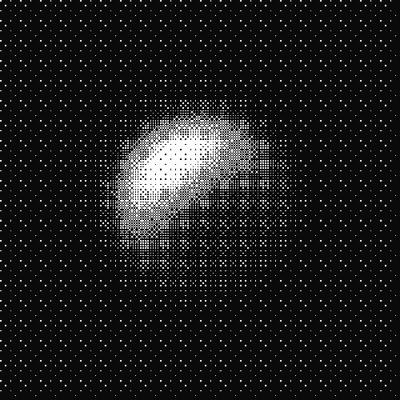

<!-- HEADER BANNER -->

<!-- MEDIA GALLERY -->
<table align="center">
  <tr>
    <td align="center" width="180">
      
    </td>
    <td align="center" width="180">
      
    </td>
    <td align="center" width="180">
      
    </td>
    <td align="center" width="180">
      
    </td>
  </tr>
</table>

<!-- VISITOR COUNTER & BADGES -->
# Hi there, I'm Nikhil Limbu! 👋

> I live and breathe the **JavaScript/TypeScript** ecosystem, daily-driving **Ubuntu** while actively falling down the **NixOS** and **NeoVim** rabbit holes. When I'm not optimizing Next.js applications or containerizing services, I'm exploring memory safety in Rust.

---

## ⚡ Quick Overview

* 🎯 **Current Focus:** Building production-grade, highly scalable apps with **React 19** and **Next.js 15**.
* ❄️ **DevOps & Infrastructure:** Deeply fascinated by declarative environments (**NixOS**) and containerization (**Docker**).
* 🦀 **Expanding Horizons:** Writing utilities in **Python** and tackling systems concepts in **Rust**.

---
## 🛠️ The Toolkit

| Category | Technologies & Tools |
| :--- | :--- |
| **💻 Frontend Development** |     |
| **⚙️ Backend & Databases** |    |
| **📦 Runtimes & Package Managers** |     |
| **❄️ Environment & Tools** |     |
| **🧪 Languages in the Cooker** |   |

---

## 📈 GitHub Metrics

### Activity & Performance

  

  
  

### Contribution Graph

---

## 🎧 Currently Tuning Into

  

---

## 📫 Let's Connect!

* **🌐 Portfolio:** [motitumbahamphe.com.np](https://motitumbahamphe.com.np/)
* **✉️ Email:** [nikhillimbu918@gmail.com](mailto:nikhillimbu918@gmail.com)
* **💼 LinkedIn:** [Nikhil Limbu](https://www.linkedin.com/in/nikhil-limbu-442209259/)

***

⭐️ Feel free to explore my repositories and connect with me! Let's build something amazing! ⭐️

